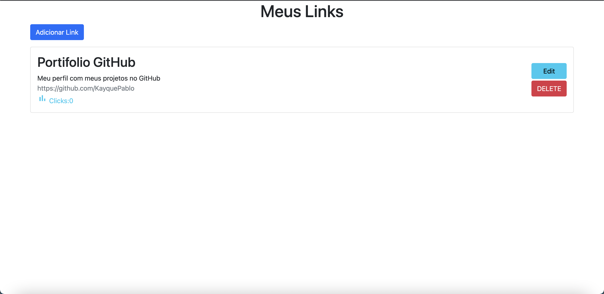
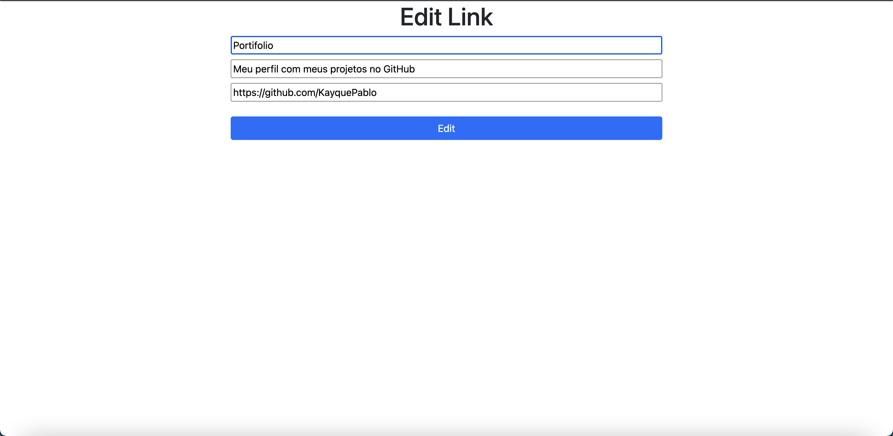

# Link Redirector

##  Descrição 📋

Esse projeto e um redirecionador de links aonde o usuario pode estar criando uma interface aonde pode adicionar suas principais redes sociais e proficionais criando assim uma pagina com todos os seus perfis.
Para ter acesso aos links basta digitar o title do link que vai ser redirecionado para aquele link. 
Ex: http://localhost:3000/Portifolio -> que vai ser redirionado diretamente para o link daquele titulo.

##  Interface do Redirecionador 📑

## Implementações 📄
- Foi Implementado um botão Edit para poder modificar algum link que esteja com algum erro ou que foi alterado
- Foi Implementado um botao DELETE para poder excluir algum link que nao deseja mais

##  Tecnologias Usadas 💻

 
 
  
  
  
 

 
